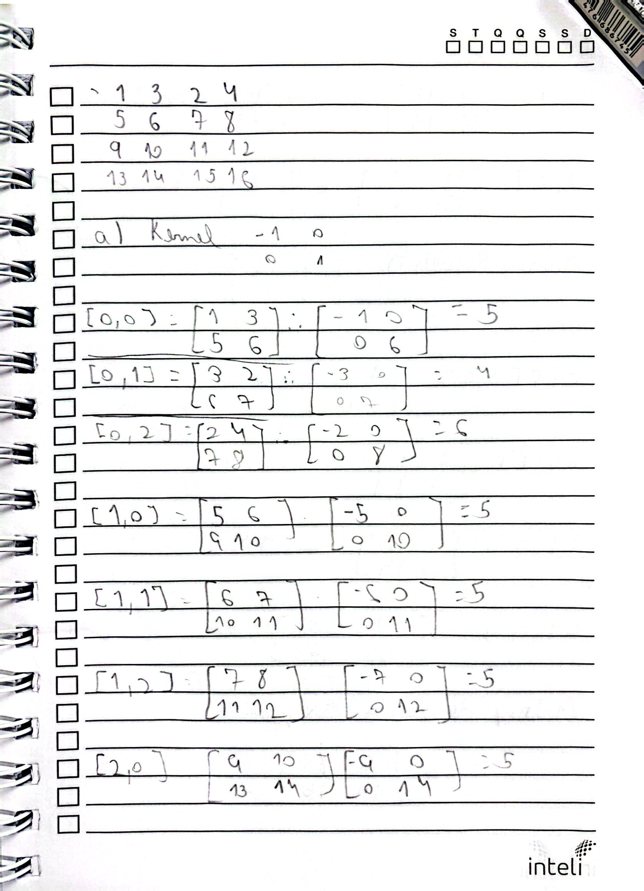
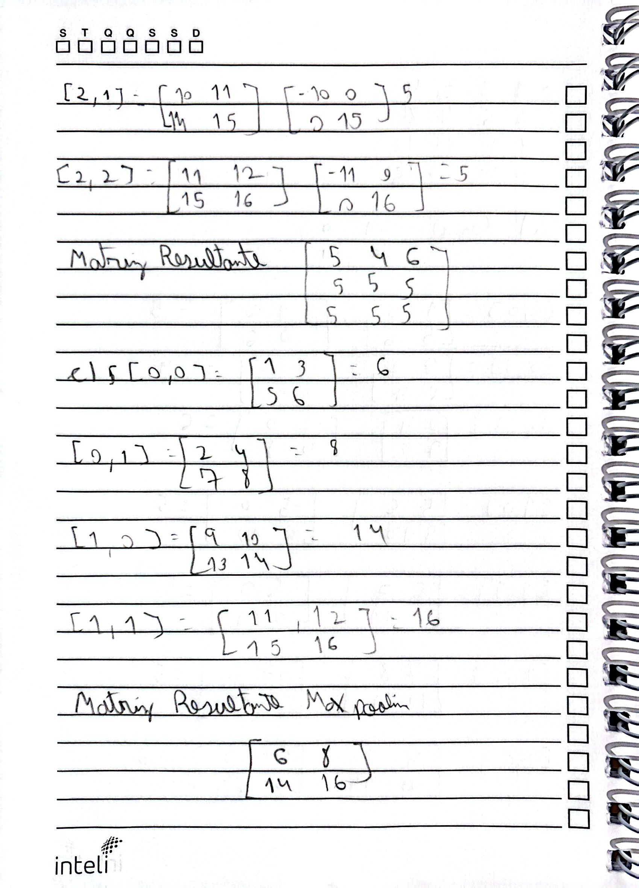
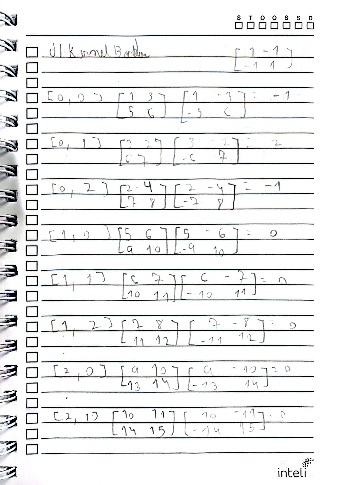

# Projeto: Convolução Manual e Max Pooling

Este projeto demonstra, passo a passo, como aplicar operações de convolução e max pooling em uma imagem (representada por uma matriz) para destacar possíveis ervas daninhas em uma plantação, conforme enunciado do problema.

---

## Enunciado do Problema

Imagine que um drone sobrevoou uma plantação e capturou uma imagem em tons de cinza, onde cada número representa a intensidade de um pixel. A imagem capturada é representada pela seguinte matriz 4x4:

```
1   3   2   4
5   6   7   8
9   10  11  12
13  14  15  16
```

Para destacar possíveis ervas daninhas, utilizamos um filtro de convolução (kernel) 2x2 que detecta mudanças abruptas na intensidade da imagem, realçando áreas onde há diferenças notáveis – que podem indicar a presença de ervas daninhas.

Os desafios do problema são:

1. **(a)** Aplicar a operação de convolução na matriz original utilizando:
   - Stride = 1 (o kernel desliza um pixel por vez)
   - Sem padding (a matriz não é ampliada)  
   Registrar a matriz resultante da convolução.

2. **(b)** Explicar como essa operação de convolução pode ajudar a detectar ervas daninhas na plantação:
   - Como o kernel ajuda a realçar as diferenças na imagem.
   - O que pode indicar a presença de uma erva daninha em uma imagem capturada por um drone.

3. **(c)** Aplicar uma operação de max pooling com:
   - Janela 2x2
   - Stride = 2  
   Registrar a matriz resultante após o pooling e explicar como essa técnica reduz a complexidade da imagem sem perder informações importantes.

4. **(d)** Considerar um kernel especializado na detecção de bordas (exemplo:  
   ```
   1  -1
   -1  1
   ```
   ) e discutir como os resultados mudariam.

---

## Abordagem e Resolução do Problema

### 1. Convolução (Partes a e d)

- **Objetivo:** Realizar a operação de convolução na imagem com dois kernels diferentes.
- **Implementação:**  
  Desenvolvi a função `convolution_step_by_step`, que percorre a matriz original com um kernel 2x2 e stride 1.  
  Em cada posição, ela:
  - Extrai uma janela da matriz.
  - Multiplica elemento a elemento pelo kernel.
  - Soma os resultados e armazena o valor na matriz de saída.
  
- **Exemplo de Cálculo (Kernel [-1, 0; 0, 1]):**  
  Para a primeira janela extraída (elementos `1, 3, 5, 6`):

  - Cálculo:  
    $$
    1 \times (-1) + 3 \times 0 + 5 \times 0 + 6 \times 1 = -1 + 0 + 0 + 6 = 5
    $$

- **Discussão sobre o Kernel:**  
  - **Kernel [-1, 0; 0, 1]:**  
    Realça as mudanças de intensidade comparando o pixel superior esquerdo com o inferior direito. Em regiões homogêneas (plantação sem ervas daninhas), a soma tende a ser zero ou próximo disso. Em áreas com mudanças abruptas, o valor é diferente, indicando possíveis ervas daninhas.
    
  - **Kernel [1, -1; -1, 1]:**  
    Este filtro enfatiza de maneira diferente as transições, realçando ainda mais as bordas. Assim, áreas com contornos definidos (possíveis bordas de ervas daninhas) podem ser destacadas de forma mais acentuada.

### 2. Max Pooling (Parte c)

- **Objetivo:** Reduzir a dimensão da imagem mantendo as informações mais salientes.
- **Implementação:**  
  Desenvolvemos a função `max_pooling_step_by_step`, que percorre a matriz original com uma janela 2x2 e stride 2.  
  Em cada janela, o valor máximo é selecionado, formando uma nova matriz com dimensões reduzidas.
  
- **Exemplo de Cálculo:**  
  Para a janela extraída (elementos `1, 3, 5, 6`), o valor máximo é `6`.

- **Benefícios:**  
  O max pooling diminui a complexidade da imagem (reduzindo a resolução) sem perder as características importantes, como bordas e picos de intensidade, que são essenciais para identificar detalhes como ervas daninhas.


## Respostas às Seções A, B, C e D

- **Seção A (Convolução):**  
  Utilizamos o kernel `[-1  0; 0  1]` com stride 1 e sem padding para percorrer a matriz original.  
  Em cada posição, os valores da janela são multiplicados elemento a elemento pelo kernel e somados, resultando na matriz de convolução:  
  ```
  [[5 4 6]
   [5 5 5]
   [5 5 5]]
  ```

- **Seção B (Detecção de Ervas Daninhas):**  
  A operação de convolução realça as mudanças de intensidade na imagem.  
  Em regiões homogêneas (plantação sem ervas daninhas), a diferença entre os pixels é pequena, gerando valores próximos de zero.  
  Em áreas com variações abruptas (possíveis ervas daninhas), o filtro gera valores maiores ou diferentes, facilitando a detecção.

- **Seção C (Max Pooling):**  
  Aplicamos max pooling com janela 2x2 e stride 2 para reduzir a dimensão da imagem.  
  Em cada bloco, o maior valor é selecionado, preservando as características salientes e diminuindo a complexidade dos dados.  
  Resultado do pooling:

  ```
  [[ 6  8]
   [14 16]]
  ```

- **Seção D (Filtro Especializado em Bordas):**  
  Com o kernel `[1 -1; -1 1]`, os sinais da operação são invertidos em relação ao kernel anterior.  
  Esse filtro enfatiza ainda mais as bordas e as transições abruptas de intensidade, realçando os contornos das ervas daninhas.

 ```
 [[-1  2 -1]
 [ 0  0  0]
 [ 0  0  0]]
  ```

---

## Estrutura do Projeto

```plaintext
.
├── imgs
│   ├── img1.jpg
│   ├── img2.jpg
│   ├── img3.jpg
│   └── img4.jpg
└── main.py
```

- **main.py:** Contém o código Python que realiza as operações de convolução e max pooling, imprimindo o passo a passo dos cálculos.
- **imgs:** Pasta contendo imagens dos cálculos manuais anotados, que demonstram detalhadamente cada etapa dos processos.

---

## Imagens dos Cálculos Manuais

Abaixo estão as imagens que mostram os cálculos manuais:

- 
- 
- 
- 

---

## Como Executar o Projeto

1. **Pré-requisitos:**  
   - Python instalado (versão 3.x).
   - Biblioteca NumPy instalada (pode ser instalada com `pip install numpy`).

2. **Passos para execução:**  
   - Navegue até o diretório do projeto:
   - Execute o script:
     ```bash
     python main.py
     ```
   - Observe o console, onde serão impressos os passos detalhados das operações de convolução e max pooling.

---

## Print do Console main.py


 ```
Matriz original (imagem):
[[ 1  3  2  4]
 [ 5  6  7  8]
 [ 9 10 11 12]
 [13 14 15 16]]

----------------------------------------

Parte (a): Convolução com o kernel:
[[-1  0]
 [ 0  1]]


Iniciando a Convolução:

Janela (posição [0, 0] da saída):
Região extraída:
[[1 3]
 [5 6]]
Multiplicação com o kernel:
[[-1  0]
 [ 0  6]]
Soma dos valores = 5

Janela (posição [0, 1] da saída):
Região extraída:
[[3 2]
 [6 7]]
Multiplicação com o kernel:
[[-3  0]
 [ 0  7]]
Soma dos valores = 4

Janela (posição [0, 2] da saída):
Região extraída:
[[2 4]
 [7 8]]
Multiplicação com o kernel:
[[-2  0]
 [ 0  8]]
Soma dos valores = 6

Janela (posição [1, 0] da saída):
Região extraída:
[[ 5  6]
 [ 9 10]]
Multiplicação com o kernel:
[[-5  0]
 [ 0 10]]
Soma dos valores = 5

Janela (posição [1, 1] da saída):
Região extraída:
[[ 6  7]
 [10 11]]
Multiplicação com o kernel:
[[-6  0]
 [ 0 11]]
Soma dos valores = 5

Janela (posição [1, 2] da saída):
Região extraída:
[[ 7  8]
 [11 12]]
Multiplicação com o kernel:
[[-7  0]
 [ 0 12]]
Soma dos valores = 5

Janela (posição [2, 0] da saída):
Região extraída:
[[ 9 10]
 [13 14]]
Multiplicação com o kernel:
[[-9  0]
 [ 0 14]]
Soma dos valores = 5

Janela (posição [2, 1] da saída):
Região extraída:
[[10 11]
 [14 15]]
Multiplicação com o kernel:
[[-10   0]
 [  0  15]]
Soma dos valores = 5

Janela (posição [2, 2] da saída):
Região extraída:
[[11 12]
 [15 16]]
Multiplicação com o kernel:
[[-11   0]
 [  0  16]]
Soma dos valores = 5

Matriz resultante da Convolução:
[[5 4 6]
 [5 5 5]
 [5 5 5]]

----------------------------------------

Parte (b): Explicação sobre a operação de convolução:

A operação de convolução com o kernel [-1  0; 0  1] realiza a seguinte operação:
    - Multiplica o pixel do canto superior esquerdo por -1 e o do canto inferior direito por +1,
      ignorando os outros dois pixels.
    
Em regiões onde a imagem apresenta intensidade uniforme (como em uma plantação homogênea),
a diferença entre os pixels tende a ser pequena e o resultado da convolução é próximo de zero.
Porém, se houver uma mudança abrupta de intensidade – por exemplo, devido à presença de uma erva daninha
com características (formato ou tom) diferentes –, a diferença entre o pixel inferior direito e o superior esquerdo será maior.
Dessa forma, o filtro realça essas transições, ajudando a identificar áreas possivelmente contendo ervas daninhas.
    

----------------------------------------

Parte (c): Aplicando Max Pooling na matriz original com janela 2x2 e stride 2
Iniciando o Max Pooling:

Janela (posição [0, 0] da saída):
Região considerada:
[[1 3]
 [5 6]]
Valor máximo nesta janela: 6

Janela (posição [0, 1] da saída):
Região considerada:
[[2 4]
 [7 8]]
Valor máximo nesta janela: 8

Janela (posição [1, 0] da saída):
Região considerada:
[[ 9 10]
 [13 14]]
Valor máximo nesta janela: 14

Janela (posição [1, 1] da saída):
Região considerada:
[[11 12]
 [15 16]]
Valor máximo nesta janela: 16

Matriz resultante após o Max Pooling:
[[ 6  8]
 [14 16]]

A operação de max pooling reduz a dimensão da imagem ao selecionar, em cada janela, o valor máximo,
preservando assim as características mais salientes (por exemplo, bordas ou picos de intensidade).
Isso diminui a complexidade da imagem, facilitando o processamento posterior sem perder informações importantes.
    

----------------------------------------

Parte (d): Convolução com o kernel especializado em bordas:
[[ 1 -1]
 [-1  1]]


Iniciando a Convolução:

Janela (posição [0, 0] da saída):
Região extraída:
[[1 3]
 [5 6]]
Multiplicação com o kernel:
[[ 1 -3]
 [-5  6]]
Soma dos valores = -1

Janela (posição [0, 1] da saída):
Região extraída:
[[3 2]
 [6 7]]
Multiplicação com o kernel:
[[ 3 -2]
 [-6  7]]
Soma dos valores = 2

Janela (posição [0, 2] da saída):
Região extraída:
[[2 4]
 [7 8]]
Multiplicação com o kernel:
[[ 2 -4]
 [-7  8]]
Soma dos valores = -1

Janela (posição [1, 0] da saída):
Região extraída:
[[ 5  6]
 [ 9 10]]
Multiplicação com o kernel:
[[ 5 -6]
 [-9 10]]
Soma dos valores = 0

Janela (posição [1, 1] da saída):
Região extraída:
[[ 6  7]
 [10 11]]
Multiplicação com o kernel:
[[  6  -7]
 [-10  11]]
Soma dos valores = 0

Janela (posição [1, 2] da saída):
Região extraída:
[[ 7  8]
 [11 12]]
Multiplicação com o kernel:
[[  7  -8]
 [-11  12]]
Soma dos valores = 0

Janela (posição [2, 0] da saída):
Região extraída:
[[ 9 10]
 [13 14]]
Multiplicação com o kernel:
[[  9 -10]
 [-13  14]]
Soma dos valores = 0

Janela (posição [2, 1] da saída):
Região extraída:
[[10 11]
 [14 15]]
Multiplicação com o kernel:
[[ 10 -11]
 [-14  15]]
Soma dos valores = 0

Janela (posição [2, 2] da saída):
Região extraída:
[[11 12]
 [15 16]]
Multiplicação com o kernel:
[[ 11 -12]
 [-15  16]]
Soma dos valores = 0

Matriz resultante da Convolução:
[[-1  2 -1]
 [ 0  0  0]
 [ 0  0  0]]

Utilizando o kernel [1 -1; -1 1], os sinais das operações são invertidos em relação ao kernel anterior.
Esse filtro enfatiza as transições de intensidade de forma diferente, realçando ainda mais as bordas.
Assim, regiões com mudanças abruptas – possivelmente correspondentes aos contornos das ervas daninhas – podem ficar ainda mais destacadas.
  ```